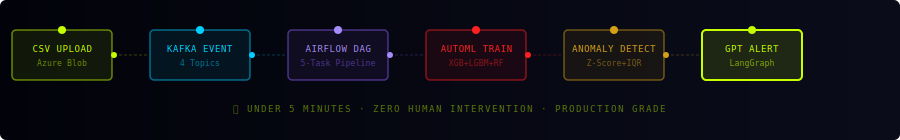
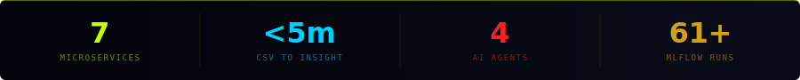

<div align="center">


<br/>

[](https://momna-bit.github.io/nexaiq-portfolio)
[](https://momna-bit.github.io/Nexaiq)
[](https://www.linkedin.com/in/momna-ali)

<br/>


</div>

---

## 🎯 What is NexaIQ?

> **"Palantir for mid-market companies."**
>
> NexaIQ is a production-grade B2B SaaS platform that turns raw business data into autonomous AI decisions — no data team required. Upload a CSV. The platform handles everything else automatically in under 5 minutes.

Mid-market companies (50–500 employees) have real business data but no affordable way to act on it. A full data team costs $500K+/year. Tools like Palantir cost millions. Power BI shows charts but doesn't think for you. **NexaIQ fixes that.**

---

## 🔗 Quick Links

| Resource | Link |
|----------|------|
| 🏆 **Portfolio & Case Study** | [momna-bit.github.io/nexaiq-portfolio](https://momna-bit.github.io/nexaiq-portfolio) |
| 🖥️ **Live Dashboard** | [momna-bit.github.io/Nexaiq](https://momna-bit.github.io/Nexaiq) |
| 📊 **MLflow Tracking** | `http://localhost:5000` (run locally) |
| 💼 **LinkedIn** | [linkedin.com/in/momna-ali](https://www.linkedin.com/in/momna-ali) |
| 📧 **Contact** | [alimomna87@gmail.com](mailto:alimomna87@gmail.com) |

---

## ⚡ Live Pipeline — Animated

<!-- Animated pipeline SVG — hosted in repo -->
<div align="center">

</div>

---

## 📊 Platform Stats

<div align="center">

</div>

---

## 🏗️ Architecture

<details>
<summary><b>🔍 Click to expand full architecture</b></summary>

```
┌──────────────────────────────────────────────────────────────┐
│               React Dashboard (GitHub Pages)                  │
└──────────────────────────┬───────────────────────────────────┘
                           │
┌──────────────────────────▼───────────────────────────────────┐
│                  7 FastAPI Microservices                       │
│  Auth:8001  │  Ingestion:8002  │  ML:8003  │  Alerts:8004    │
│  Query:8005 │  Monitoring:8006 │  RAG:8007                   │
└──────────────────────────┬───────────────────────────────────┘
                           │
┌──────────────────────────▼───────────────────────────────────┐
│   Apache Kafka (4 topics) ──────► Apache Airflow DAGs         │
│   file.uploaded │ pipeline.completed │ model.trained          │
└──────────────────────────┬───────────────────────────────────┘
                           │
┌──────────────────────────▼───────────────────────────────────┐
│  PostgreSQL │ MongoDB Atlas │ Azure Blob │ ChromaDB │ MLflow  │
└──────────────────────────┬───────────────────────────────────┘
                           │
┌──────────────────────────▼───────────────────────────────────┐
│  OpenAI GPT-3.5 │ LangGraph 4 Agents │ RAG Pipeline          │
└──────────────────────────────────────────────────────────────┘
```

</details>

---

## 🚀 How It Works — Step by Step

<details>
<summary><b>01 — Secure Ingestion (Azure Blob + DBT)</b></summary>

```python
POST /ingest/upload
# CSV → Azure Blob (org-isolated container)
# Kafka fires: file.uploaded event
# Airflow DAG triggers automatically
# DBT: RAW → CLEAN → MART
```
</details>

<details>
<summary><b>02 — AutoML Training (MLflow)</b></summary>

```python
# 4 models train simultaneously
XGBoost · LightGBM · RandomForest · LogisticRegression
# Best model auto-selected by AUC score
# All 61+ runs logged → http://localhost:5000
```
</details>

<details>
<summary><b>03 — Anomaly Detection (Z-Score + IQR)</b></summary>

```python
# Dual-method detection on every column
# Flags: revenue spikes, churn shifts, inventory drops
# Instant — fires the moment data lands
```
</details>

<details>
<summary><b>04 — GPT Executive Alert</b></summary>

```
"Revenue in Q4 is 2.65 standard deviations above the mean,
suggesting an unusual revenue spike. Investigation recommended."
— Written by GPT-3.5, no analyst needed
```
</details>

<details>
<summary><b>05 — Text-to-SQL Natural Language Query</b></summary>

```
User:   "Why did revenue drop last month?"
GPT:    SELECT region, SUM(revenue) FROM mart_sales WHERE...
Result: Structured table — zero SQL knowledge needed
```
</details>

<details>
<summary><b>06 — LangGraph Autonomous Agents</b></summary>

```
Analyst Agent    → finds root cause in data
Report Writer    → drafts executive summary
Critic Agent     → validates (threshold: 8/10)
Action Agent     → fires alerts and notifications
Total: < 30 seconds. Zero human intervention.
```
</details>

---

## 📊 MLflow Experiment Tracking

```bash
# Access at: http://localhost:5000
# 61+ experiment runs tracked automatically
```

<details>
<summary><b>📈 How to compare models in MLflow</b></summary>

1. Open `http://localhost:5000`
2. Click experiment `nexaiq-{org_id}`
3. Select multiple runs → click **Compare**
4. View side-by-side accuracy, AUC, F1 score charts
5. Best model auto-registered in Model Registry

**Models tracked:** XGBoost · LightGBM · RandomForest · LogisticRegression

</details>

---

## 🛠️ Tech Stack

| Category | Technologies |
|----------|-------------|
| **Languages** | Python 3.11, TypeScript |
| **Backend** | FastAPI, SQLAlchemy, Pydantic |
| **Frontend** | React 18, TypeScript, Tailwind CSS, Recharts, Zustand |
| **Data Pipeline** | Apache Airflow, Apache Kafka (4 topics), DBT |
| **ML / MLOps** | XGBoost, LightGBM, RandomForest, MLflow, Evidently AI |
| **AI / GenAI** | OpenAI GPT-3.5, LangGraph, ChromaDB, RAG Pipeline |
| **Databases** | PostgreSQL, MongoDB Atlas, ChromaDB |
| **Cloud** | Azure Blob Storage, Azure Container Apps |
| **Infra** | Docker, Kubernetes HPA (5 replicas), GitHub Actions |
| **Monitoring** | Prometheus, Grafana, Liveness/Readiness Probes |

---

## 🗂️ Project Structure

<details>
<summary><b>📁 Click to expand project structure</b></summary>

```
nexaiq/
├── backend/
│   ├── auth_service/        # Port 8001 — JWT + RBAC + Multi-tenant
│   ├── ingestion_service/   # Port 8002 — Azure Blob + DBT pipeline
│   ├── ml_service/          # Port 8003 — AutoML + MLflow tracking
│   ├── alert_service/       # Port 8004 — Anomaly detection + GPT alerts
│   └── query_service/       # Port 8005 — Text-to-SQL
├── airflow_dags/            # 5-task DAG pipeline
├── agents/                  # LangGraph 4-agent workflow
├── docker/                  # Dockerfiles for all services
├── frontend/                # React 18 + TypeScript dashboard
├── k8s/                     # Kubernetes + HPA configs
├── kafka/                   # Kafka producer + consumer
├── mongodb/                 # MongoDB Atlas client
├── monitoring/              # Port 8006 — Prometheus
├── nexaiq_dbt/              # DBT models + tests (PASS=2, WARN=0)
├── rag/                     # Port 8007 — ChromaDB + RAG
├── start.sh                 # Start all services
├── docker-compose.yml       # Local dev environment
└── .env.example             # Environment template
```
</details>

---

## ⚙️ Local Setup

<details>
<summary><b>🚀 Click to expand setup instructions</b></summary>

```bash
# 1. Clone
git clone https://github.com/Momna-bit/Nexaiq.git
cd Nexaiq

# 2. Environment
cp .env.example .env
# Add your API keys to .env

# 3. Kill existing ports (Windows)
for port in 8001 8002 8003 8004 8005 8006 8007 5000; do
  pid=$(netstat -ano | grep ":$port " | grep LISTENING | awk '{print $5}' | head -1)
  if [ ! -z "$pid" ]; then taskkill //F //PID $pid 2>/dev/null; fi
done

# 4. Start all services
bash start.sh

# 5. Start monitoring
cd monitoring && uvicorn main:app --port 8006 &

# 6. Start frontend
cd frontend && npm install && npm run dev
```

**Service URLs:**
| Service | URL |
|---------|-----|
| Auth | http://127.0.0.1:8001 |
| Ingestion | http://127.0.0.1:8002 |
| ML | http://127.0.0.1:8003 |
| Alerts | http://127.0.0.1:8004 |
| Query | http://127.0.0.1:8005 |
| Monitoring | http://127.0.0.1:8006 |
| RAG | http://127.0.0.1:8007 |
| MLflow UI | http://127.0.0.1:5000 |
| Frontend | http://localhost:5173 |

</details>

---

## 🐳 Docker & Kubernetes

<details>
<summary><b>🐳 Docker</b></summary>

```bash
docker-compose up --build
```
</details>

<details>
<summary><b>☸️ Kubernetes</b></summary>

```bash
kubectl apply -f k8s/
kubectl get pods
kubectl get hpa   # scales to 5 replicas at 70% CPU
```
</details>

---

## 📡 API Reference

<details>
<summary><b>📡 Click to expand all endpoints</b></summary>

```
Auth :8001     POST /auth/login · GET /auth/me · POST /auth/register
Ingest :8002   POST /ingest/upload · GET /ingest/status/{id} · GET /ingest/datasets
ML :8003       POST /ml/train · GET /ml/models · GET /ml/runs
Alerts :8004   GET /alerts · POST /alerts/detect · GET /alerts/{id}
Query :8005    POST /query/ask · GET /query/history
RAG :8007      POST /rag/upload · POST /rag/ask · GET /rag/documents
```
</details>

---

## 📋 What This Demonstrates

| Domain | Skills |
|--------|--------|
| **Data Engineering** | Airflow, DBT, Kafka, Azure Blob, ETL, multi-layer warehouse |
| **ML Engineering** | AutoML, MLflow, model registry, experiment tracking |
| **AI Engineering** | RAG pipeline, LangGraph agents, vector search, prompt engineering |
| **Backend Engineering** | 7 microservices, FastAPI, PostgreSQL, MongoDB, JWT, RBAC |
| **Frontend Engineering** | React 18, TypeScript, enterprise UI design |
| **DevOps** | Docker, Kubernetes, GitHub Actions, Prometheus, Grafana |
| **Cloud** | Azure Blob Storage, Azure Container Apps, MongoDB Atlas |

---

## 🔐 Security

- JWT authentication + RBAC (Admin / Analyst / Viewer)
- Multi-tenant org isolation — every user scoped by `org_id`
- Azure Blob org-isolated containers — no cross-tenant access
- All secrets via `os.getenv()` — never hardcoded
- `.env` in `.gitignore`

---

## 👩‍💻 Built By

**Momna Ali** — Data Engineer · ML Engineer · AI Engineer · Data Scientist

[](https://www.linkedin.com/in/momna-ali)
[](https://momna-bit.github.io/nexaiq-portfolio)
[](https://momna-bit.github.io/Nexaiq)
[](mailto:alimomna87@gmail.com)

---

<div align="center">


*⭐ Star this repo if you find it impressive!*
</div>
